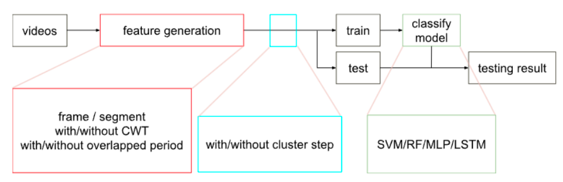

# Thesis research

Thesis link:

[Analysis of the effects of training samples and features on classification of sng and pain in mice](https://drive.google.com/file/d/1exDkK8w42m5tgW8LIoWAVaezUuBNTIpw/view?usp=share_link)

----

### Thesis abstract
Mice have been an important reference for the drug test. Currently, it is only possible to
collect the feedbacks from mice through non-verbal methods. The most common ways to
observe the status of mice are through the facial expressions or behaviors. Due to recent advance
of machine learning, its utilities have been demonstrated in many applications. One of them is
analysis in the facial expressions or behaviors of mice. However, there are usually two major
challenges when applying supervised machine learning algorithms. The first one is individual
variation on facial expression or behaviors, which might require a huge amount of data set to
overcome. The second one is how to obtain reliable labels, which are fundamental to train a
robust machine learning model. Especially in the research of sng and pain of mice, human
beings are unable to label the data set by verbal communications.
This thesis aimed on the analysis of the effects of training samples and features on different
classification architectures to overcome the above two challenges. The compared architectures

included selection of training samples, feature extraction of mouse behavior, and temporal
resolution of video frames combining with different types of machine learning models. These
architectures were analyzed on the same dataset through the experiments. The accuracy, false
alarm and detection rate were used to evaluate their performance on a small data set and the
individuals excluded from the training procedure of the models. This thesis also proposed an
unsupervised approach that can be embedded into these architectures in order to reduce the
impact of overfitting and non-reliable labels.

----

### Main Contributions

* Introducing temporal features for classification of mice states
* Utilizing motion analysis approaches to reduce the impact of overfitting and non-reliable labels
* Investigating the impacts of the transformations and finding the best performing architecture
* Propose an experiment structure with blind-testing dataset to verify the reliability of trained models in realistic application

----

### Experiment structure

 

* Integrated different feature extraction methods
* Embedded clustering step
* Model setups

Total 38 combinations of architectures

----

### Features

* Automatic pipeline
* Flexible input features, feature extraction and model setup (modular design)
* Trackable training samples (keep correspondence of mice and video with each training sample)
